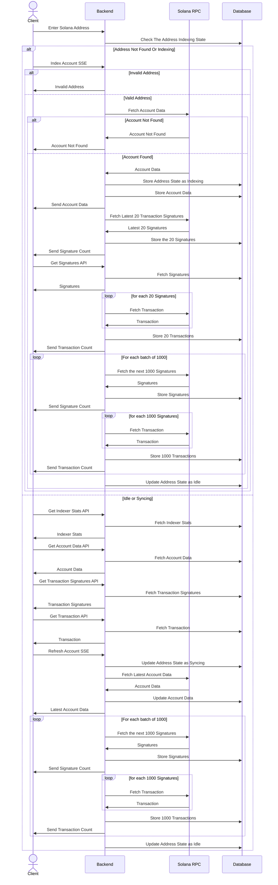

# Solwatch 🛰️ (Still in Development)
A minimal and fast lazy indexer for the Solana blockchain.

## Technologies
- **Backend:** Rust (Axum, Tokio)
- **Frontend:** React
- **Database:** MongoDB
- **Deployment:** Docker Compose

## Getting Started
1. Clone the repository
   ```bash
   git clone https://github.com/tharun-damera/solwatch.git
   ```
2. Go to the project directory
   ```bash
   cd solwatch
   ```
3. Run the services using docker compose in detached mode
   ```bash
   docker compose up -d
   ```
5. Check the frontend running [here](http://localhost:8000/)
6. To shutdown the services run
   ```bash
   docker compose down
   ```

## Sequence Diagram

