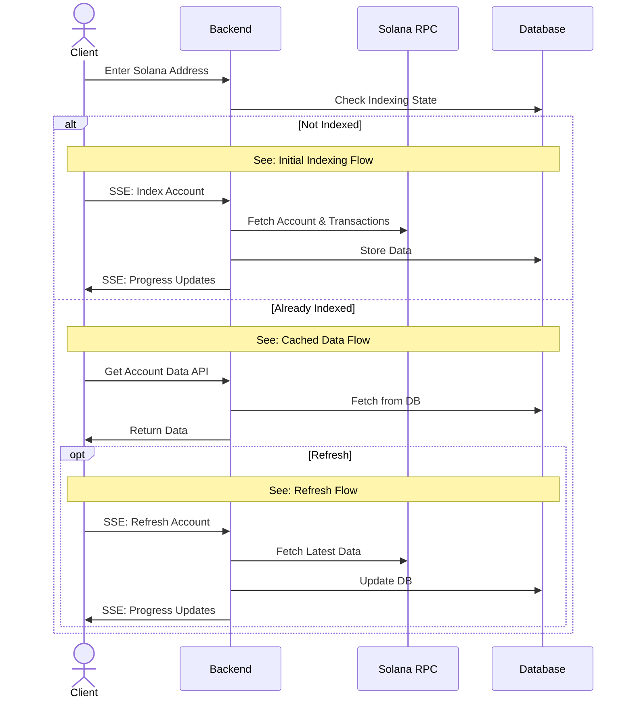
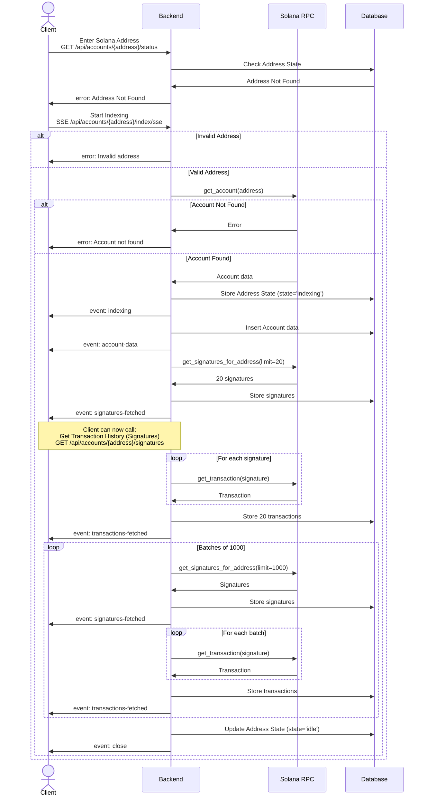
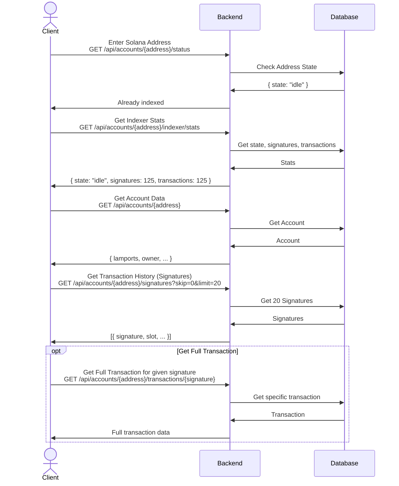
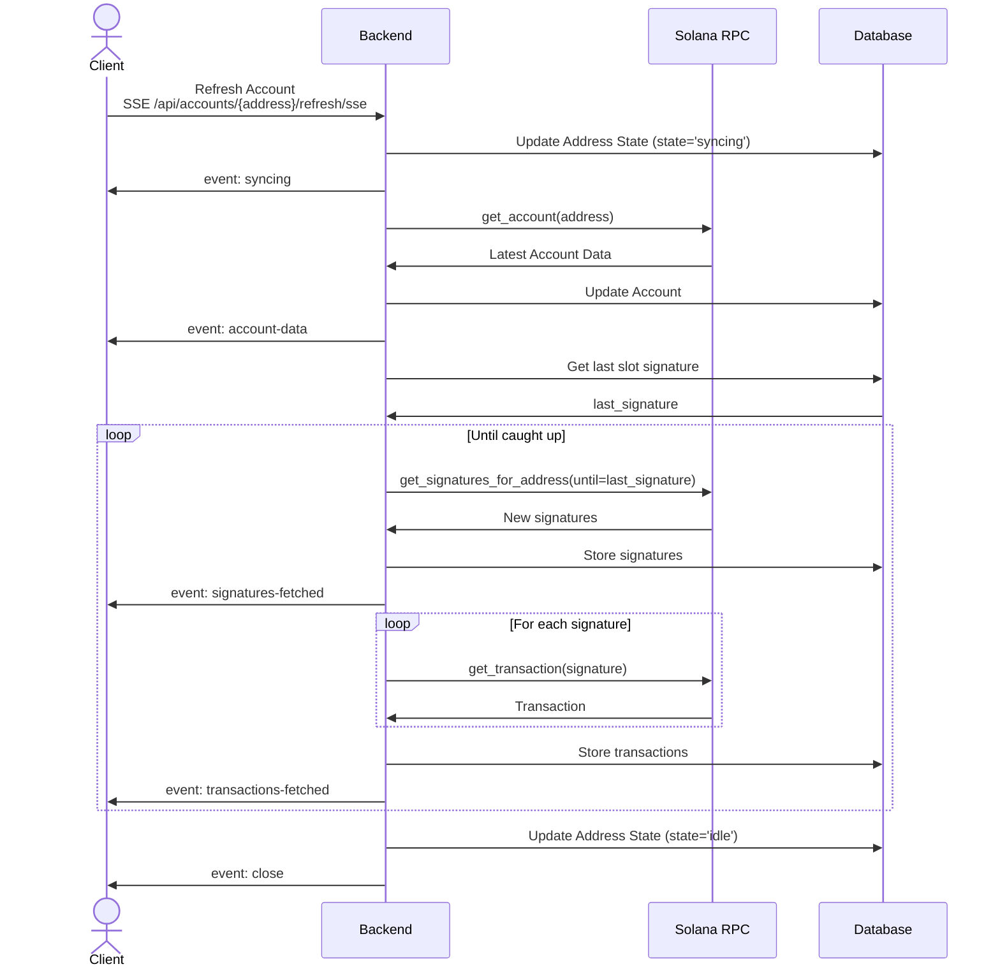

# Solwatch 🛰️ (Still in Development)
A minimal and fast lazy indexer for the Solana blockchain.

## Technologies
- **Backend:** Rust (Axum, Tokio)
- **Frontend:** React
- **Database:** MongoDB
- **Deployment:** Docker Compose

## Getting Started
1. Clone the repository
   ```bash
   git clone https://github.com/tharun-damera/solwatch.git
   ```
2. Go to the project directory
   ```bash
   cd solwatch
   ```
3. Run the services using docker compose in detached mode
   ```bash
   docker compose up -d
   ```
5. Check the frontend running [here](http://localhost:8000/)
6. To shutdown the services run
   ```bash
   docker compose down
   ```

# Architecture

## System Flow Overview

The system handles three main scenarios:
1. **Initial Indexing** - When an address is queried for the first time
2. **Cached Data Access** - When data already exists in the database
3. **Refresh/Sync** - When updating an indexed address with latest data

## Detailed Flows

### 1. Initial Indexing Flow
When a new address is indexed, the system:
- Validates the address
- Fetches account data from Solana RPC
- Stores the account in the database
- Fetches the latest 20 transactions immediately for quick display
- Continues fetching remaining transactions in batches of 1000
- Sends real-time progress updates via SSE


### 2. Cached Data Access
When accessing already-indexed data:
- All data is served directly from MongoDB
- No RPC calls needed
- Fast response times


### 3. Refresh Flow
When refreshing an indexed address:
- Fetches only new data since last sync
- Updates account information
- Fetches new transactions incrementally


