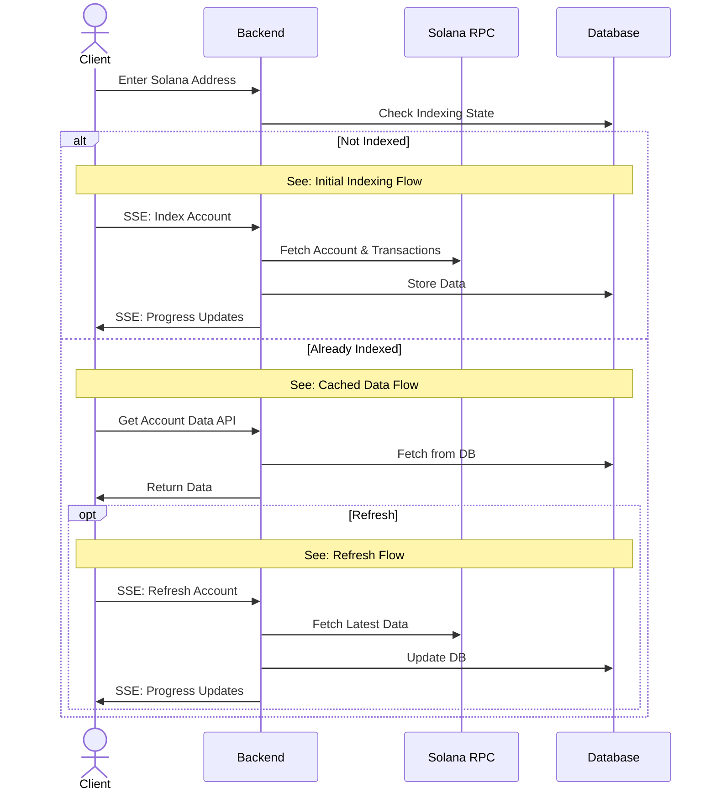
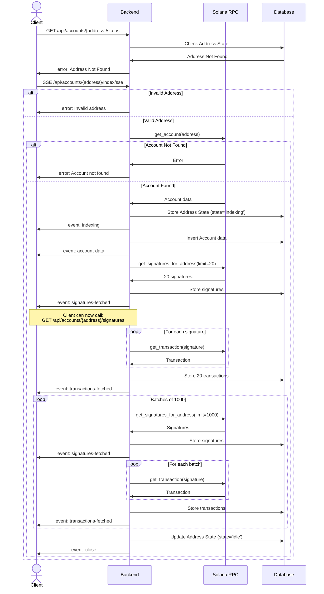
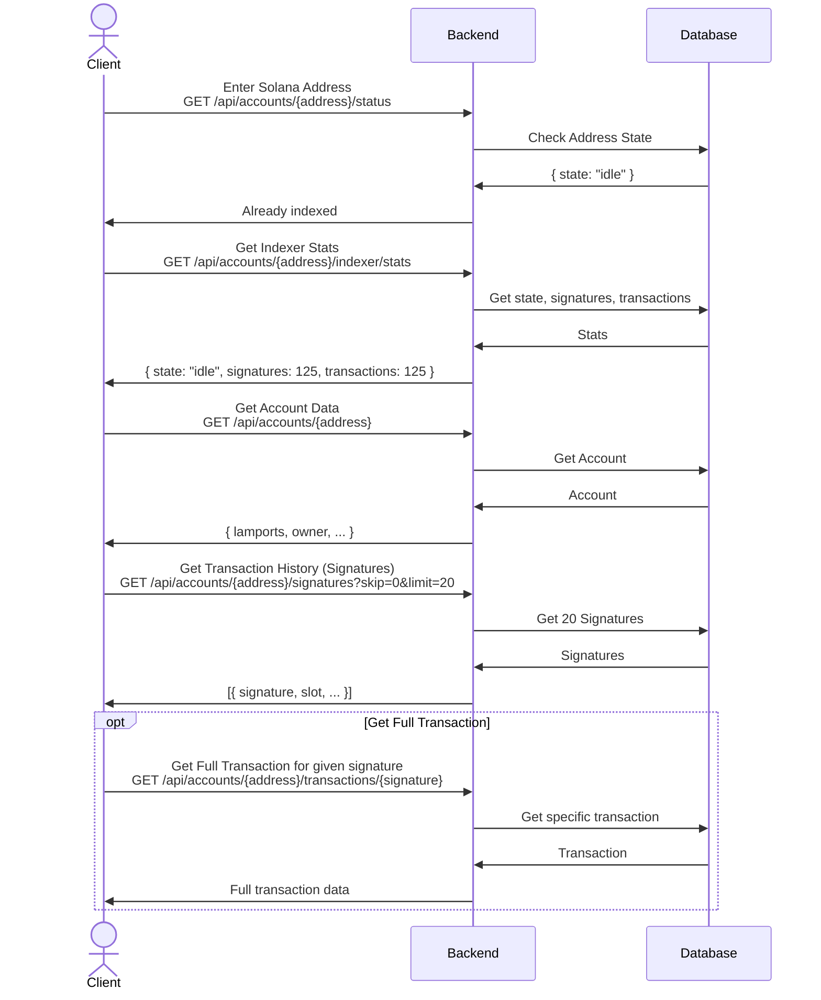

# Solwatch 🛰️ (Still in Development)
A minimal and fast lazy indexer for the Solana blockchain.

## Technologies
- **Backend:** Rust (Axum, Tokio)
- **Frontend:** React
- **Database:** MongoDB
- **Deployment:** Docker Compose

## Getting Started
1. Clone the repository
   ```bash
   git clone https://github.com/tharun-damera/solwatch.git
   ```
2. Go to the project directory
   ```bash
   cd solwatch
   ```
3. Run the services using docker compose in detached mode
   ```bash
   docker compose up -d
   ```
5. Check the frontend running [here](http://localhost:8000/)
6. To shutdown the services run
   ```bash
   docker compose down
   ```

# Architecture

## System Flow Overview

The system handles three main scenarios:
1. **Initial Indexing** - When an address is queried for the first time
2. **Cached Data Access** - When data already exists in the database
3. **Refresh/Sync** - When updating an indexed address with latest data

## Detailed Flows

### 1. Initial Indexing Flow
When a new address is indexed, the system:
- Validates the address
- Fetches account data from Solana RPC
- Stores the account in the database
- Fetches the latest 20 transactions immediately for quick display
- Continues fetching remaining transactions in batches of 1000
- Sends real-time progress updates via SSE


### 2. Cached Data Access
When accessing already-indexed data:
- All data is served directly from MongoDB
- No RPC calls needed
- Fast response times


### 3. Refresh Flow
When refreshing an indexed address:
- Fetches only new data since last sync
- Updates account information
- Fetches new transactions incrementally
```mermaid

```


## Sequence Diagram
```mermaid
sequenceDiagram
    actor C as Client
    participant B as Backend
    participant S as Solana RPC
    participant D as Database

    C->>B: Enter Solana Address
    B->>D: Check The Address Indexing State

    alt Address Not Found Or Indexing
        C->>B: Index Account SSE
        alt Invalid Address
            B->>C: Invalid Address
        else Valid Address
            B->>S: Fetch Account Data
            alt Account Not Found
                S->>B: Account Not Found
                B->>C: Account Not Found
            else Account Found
                S->>B: Account Data
                B->>D: Store Address State as Indexing
                B->>D: Store Account Data
                B->>C: Send Account Data
                B->>S: Fetch Latest 20 Transaction Signatures
                S->>B: Latest 20 Signatures
                B->>D: Store the 20 Signatures
                B->>C: Send Signature Count
                C->>B: Get Signatures API
                B->>D: Fetch Signatures
                B->>C: Signatures
                loop for each 20 Signatures
                    B->>S: Fetch Transaction
                    S->>B: Transaction
                end
                B->>D: Store 20 Transactions
                B->>C: Send Transaction Count
                loop For each batch of 1000
                    B->>S: Fetch the next 1000 Signatures
                    S->>B: Signatures
                    B->>D: Store Signatures
                    B->>C: Send Signature Count
                    loop for each 1000 Signatures
                        B->>S: Fetch Transaction
                        S->>B: Transaction
                    end
                    B->>D: Store 1000 Transactions
                    B->>C: Send Transaction Count
                end
                B->>D: Update Address State as Idle
            end
        end
    else Idle or Syncing
        C->>B: Get Indexer Stats API
        B->>D: Fetch Indexer Stats
        B->>C: Indexer Stats
        C->>B: Get Account Data API
        B->>D: Fetch Account Data
        B->>C: Account Data
        C->>B: Get Transaction Signatures API
        B->>D: Fetch Transaction Signatures
        B->>C: Transaction Signatures
        C->>B: Get Transaction API
        B->>D: Fetch Transaction
        B->>C: Transaction

        C->>B: Refresh Account SSE
        B->>D: Update Address State as Syncing
        B->>S: Fetch Latest Account Data
        S->>B: Account Data
        B->>D: Update Account Data
        B->>C: Latest Account Data
        loop For each batch of 1000
            B->>S: Fetch the next 1000 Signatures
            S->>B: Signatures
            B->>D: Store Signatures
            B->>C: Send Signature Count
            loop for each 1000 Signatures
                B->>S: Fetch Transaction
                S->>B: Transaction
            end
            B->>D: Store 1000 Transactions
            B->>C: Send Transaction Count
        end
        B->>D: Update Address State as Idle
    end
```
